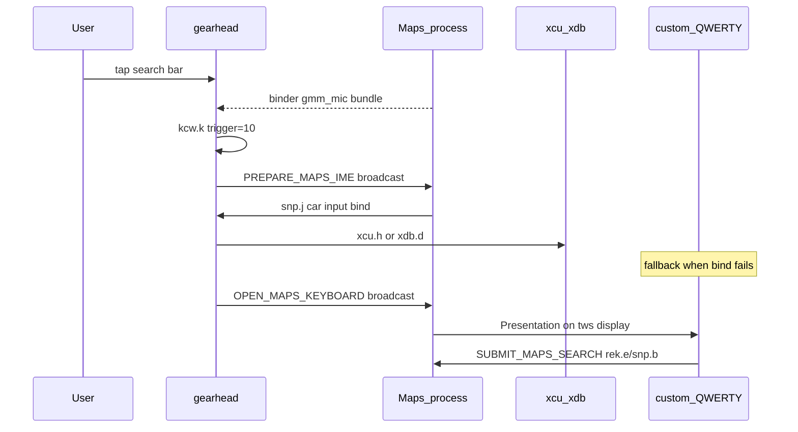

# Maps AA Search Keyboard — Debug Postmortem

> **Display compositing & overlay failures (2026-06-16+):** see [LEARNINGS_AND_FAILURES.md](LEARNINGS_AND_FAILURES.md) for GhostActivity vs `tws` displays, crash at `car-WindowManager`, Presentation success, and transparent overlay UX (2026-06-17).

Session logs: `logs/log/modules_2026-06-16T18:53:18.905763.log`  
Environment: **Android Auto 17.1.662404 + Google Maps** (DHU or head unit), LSPosed module v99999.

> Other AA clients (e.g. third-party hosts) are out of scope for pass/fail criteria.

## Goal

- Search bar tap → **QWERTY** projected keyboard (stock `snp`/`xcu` path or custom overlay fallback)
- Mic icon tap → **voice dictation** (preserved)
- Hint text → **"Type anytime"** (working)

## Architecture



### Multi-process trap

Static caches (`lastSearchGxy`, `activeImeService`, `lastRel`, `lastMapsCarHost`) are **per-process**. Gearhead PID handling `kcw.k(10)` often differs from the PID that constructed `gxy` or received `xcu.c`. `findRunningXcuService()` scans `ActivityThread.mServices` when cache is empty.

### Observed tap path (AA 17.x + Maps)

Search tap often goes:

`Maps gmm_mic IPC` → gearhead `xqd.e` → `qcu` case 10 → `kcw.k(10)` → voice (`kxe.F(10)`).

Maps hooks for `lka.z` / `qhf.l` may not run on every search tap — gearhead intercept + cross-process broadcast still applies.

## Failure catalog

| Phase | Approach | Symptom | Root cause |
|-------|----------|---------|------------|
| Early | Synthetic `kkl` + `kxe.O(jxa)` | NPE "null array" | Wrong `kkl` constructor args |
| 19:10 | `kxe.O(jxa)` as keyboard | Dictation UI | `jxa` → `kxe.ac type=6` transcription |
| 19:23 | `qib.l(10)` redirect | Dictation / demand-space | `qib.l` → `kxe.O(null)` type-6 |
| 19:44 | `xqd.e` intercept on binder thread | Gray overlay, no keyboard | `kxe.O(jxa)` off main thread; `qib.p()` alone = scrim |
| 19:50 | `xcu.h()` when cached | Dead tap | `h()` early exit; `k`/`q` never set |
| 19:52+ | Remove jxa; projected IME only | Dead tap | No `xcu`/`xdb` cached at tap time |
| 20:01 | Broadcast to Maps | `no rek overlay or car host` | `rel` never invoked; host not cached |
| 20:04 | `kxe.O(qjo)` direct | `no gearhead input view` | No foreground Activity decor in gearhead |
| 20:21 | Mic + search same path | Mic silent | `tur.s()` was blocked; both use `gmm_mic` → `kcw.k(10)` |
| **Recovery** | Custom overlay + Maps submit | — | `GH-KBD-001` → `MAPS-KBD-001` |

## Mic vs search separation

| UI element | Path | Module policy |
|------------|------|---------------|
| Search bar tap | `kcw.k(10)` / `gmm_mic` IPC | Block `kxe.F/G(10)`; open QWERTY or overlay |
| Mic icon (gearhead Car App) | `hgy.c(kkl)` → `jxa` | Allow — log `GH-MIC-001` |
| Mic icon (Maps header) | `tur.s()` → `gmm_mic` | Allow — `MAPS-MIC-001` + `GH-MIC-002` MAPS_MIC_VOICE |
| Search (Maps header) | `qhf.l()` → `rek.d` | Keyboard — log `MAPS-001` |

When `inMapsMicFromHeader()` is true, `kcw.k(10)` skips keyboard open and voice blocks.

## Log success criteria

### Search bar tap (stock path — prefer)

- `MAPS-003 snp.j() bind car input`
- `MAPS-003 snp.k() show car IME` or `reh.b() requested car IME`
- `GH-MAPS-000 cached active IME service` or `discovered running xcu service`
- `GH-MAPS-003 xcu.h() started PhoneKeyboardActivity` or `force-started PhoneKeyboardActivity`

### Search bar tap (custom overlay fallback — current working path)

- `MAPS-KBD-001 stock keyboard failed — showing custom QWERTY`
- `MAPS-KBD-003 attach target=tws-Presentation:…/tws:N`
- `MAPS-KBD-005 panel measured 800x<H> host=tws-Presentation`
- `GH-KBD-004 broadcast SUBMIT_MAPS_SEARCH to Maps` (on Search key)
- `MAPS-KBD-001 submitted via rek.e` / `snp.b` / `geo intent fallback`

### Overlay dismiss (must work on car)

- `MAPS-KBD-002 tap outside keyboard`
- `MAPS-KBD-002 keyboard toggle — closed overlay`
- `GH-KBD-002 hide overlay`
- `MAPS-KBD-002 broadcast CLOSE_MAPS_KEYBOARD` (layout change)

### Search bar tap (must NOT see)

- `kxe.ac type=6 transcription session started` (on search tap)
- `GH-MAPS-003 kxe.O(jxa) invoked` (during search)

### Mic tap (must see)

- `MAPS-MIC-001 tur.s() mic voice allowed` and/or `GH-MIC-001 hgy.c(kkl)`
- `GH-MIC-002 MAPS_MIC_VOICE received`
- Voice UI starts; **no** `kxe.F(10) blocked` on mic tap

### Hint (working)

- `MAPS-HINT-001` / `GH-HINT-001`

## Recovery strategy (implemented)

1. **Prepare before open**: gearhead broadcasts `ACTION_PREPARE_MAPS_IME` (Maps runs `rel.d` → `snp.j/k`).
2. **Surgical `kcw.k`**: allow stock `kcw.k`; block voice via `kxe.F`/`G`; open keyboard in `afterHookedMethod` (skip when mic flag set).
3. **xcu service scan** when per-process cache empty.
4. **Custom QWERTY overlay** (`ProjectedKeyboardOverlay`) when all stock paths fail — attach via **`Presentation` on `maps/tws` display** (car-visible).
5. **Maps query submit** via `ACTION_SUBMIT_MAPS_SEARCH` → `rek.e` / `snp.b` / geo intent.
6. **Overlay lifecycle** (2026-06-17): transparent window, tap-outside dismiss, toggle on re-tap, `ACTION_CLOSE_MAPS_KEYBOARD` on AA layout change.
7. **Voice Plate mic icon** → keyboard drawable (`VoicePlateMicIcon`) so UI matches keyboard-on-tap behavior.

## Overlay attach evolution (Maps process)

| Phase | Attach target | Car visible? | Notes |
|-------|---------------|--------------|-------|
| Early | gearhead decor | No | Wrong PID |
| v1 | Maps `activity-decor` | No | Under `tws` SurfaceView |
| v2 | `activity-WindowManager` | No | Sized OK, wrong layer |
| v3 | `ViewOverlay` | No | Often `0×0` |
| v4 | `car-WindowManager` | **Crash** | ANR + process death |
| **v5** | **`tws-Presentation`** | **Yes** | Primary path |
| v5b | `TouchCaptureShell` (opaque) | Yes but broken UX | White sheet, can't close — **replaced** with `KeyboardDismissRoot` |

Pass criteria:

```
MAPS-KBD-003 attach target=tws-Presentation:com.google.android.apps.maps/tws:<id>
MAPS-KBD-005 panel measured 800x<H> host=tws-Presentation
```

## Overlay dismiss / toggle (2026-06-17)

| Trigger | Mechanism |
|---------|-----------|
| ✕ button | `ProjectedKeyboardOverlay.hide()` |
| Tap map area above keys | `KeyboardDismissRoot` → `dismissFromUserTap()` |
| Re-tap search / keyboard icon | `toggleIfVisible()` in `openMapsKeyboard` / `show()` |
| AA layout / template change | `CLOSE_MAPS_KEYBOARD` broadcast; Maps `onConfigurationChanged` / `onStop` |
| Trailing OPEN after toggle | `shouldSuppressNextOpen()` (800ms) |

## Voice Plate icon (2026-06-17)

Maps search bar mic is not drawn by Maps Java code directly — it arrives as `VoicePlateWidget` → gearhead Compose (`hjq`/`hjv`). Hooks rewrite:

- `VoicePlateWidget` constructor + `getIcon()` — `CarIcon`
- `hjq` constructor — `fyt` internal icon
- `hjv` constructor — `fyh` Compose icon

Replacement drawable: gearhead `ic_keyboard_black_24dp` (fallbacks: `gs_keyboard_capslock_vd_theme_24`). Log: `GH-ICON-001` / `GH-ICON-002`.

## What we stopped doing

- `kxe.O(jxa)` / synthetic `kkl` as keyboard opener
- `qib.l(10)` as keyboard fallback
- Blocking `tur.s()` (Maps header mic) to open keyboard
- Full block of `kcw.k(10)` without `qib.p()`
